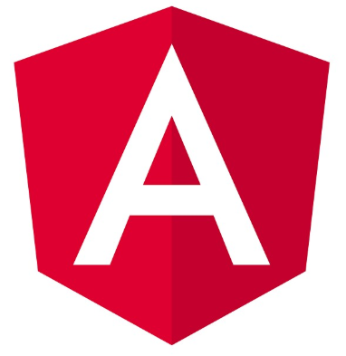

# i18n-web

`i18n-web` is a simple tool helps in externalizing the strings in a JavaScript based Application such that, Internationalization(i18n) can be achieved easily. It has the additional capability of parameterizing the strings to get the dynamic content Internationalized.

# Install

- Using yarn: `yarn add i18n-web`
- Using npm: `npm install i18n-web`

# What is String Externalization?
String Externalization means, instead of writing the user(or customer) facing strings in source files(.html, .js, .java etc), we keep them in an external file like .properties, .json etc and load from there. This is to help Internationalization (i18n).

# What is Internationalization (i18n)?
In Software, Internationalization (i18n) is the process to support various local languages like, English(en), Spanish(es), German(de) etc. 

All the browsers come with the in-built support of languages which can be used to identify the local language to support for the application.

# How String Externalization help in Internationalization (i18n) of the Web Applications?
A Web Application may have the need of supporting multiple languages based on the targeted users. If the Application Strings are Externalized outside of the source files, it is easy and flexible to support i18n.

Lets consider, all the application strings are in a file called `en.json` and this file can be loaded into the application to retrieve the strings when the app is running in English Language.

```js
{
    'username': 'User Name',
    'password': 'Password',
    'hasBlog': '{0} has a blog named, {1}. This is on {2}.'
}
```

Now there could be equivalent `es.json` file which can be loaded into the application when browser supported language is Spanish instead of English.

```js
{
    'username': 'Nombre de usuario',
    'password': 'Contraseña',
    'hasBlog': '{0} tiene un blog llamado {1}. Esto está en {2}.'
}
```

# i18n-web Usage

## Basic Setup and Structure

The tool `i18n-web` helps in externalizing the string and thus, internationalizing your web app with few quick and easy steps.

- Create a folder called `i18n` at the same lavel of `node_modules` folder of your app.
- Create `en.js`, `es.js`, `de.js` etc file to contain your application specific strings externalized. You must add all required language .js files that your app would support.

Here is an example of the en.js and es.js file.

```js
// en.js
const en = {
    'username': 'User Name',
    'password': 'Password',
    'hasBlog': '{0} has a blog named, {1}. This is on {2}.'
}

export { en };

```

```js
// es.js
const es = {
    'username': 'Nombre de usuario',
    'password': 'Contraseña',
    'hasBlog': '{0} tiene un blog llamado {1}. Esto está en {2}.'
}
export { es };
 ```

- Create another file called, `index.js` where you can aggregate the all modules and export together like this:

```js
export { en } from './en.js';
export { xh } from './xh.js';
export { es } from './es.js';
```

Example Directory Structure:

```
myapp                         
    └── i18n
        └── en.js
        └── es.js
        └── index.js                
    └── node_modules                    
```

## Using it in UI Code

- In your UI Code, import it as,

```js
import i18n from 'i18n-web';
```

- Use it like:

```js
// When no parameters. Just Key is passed
console.log(i18n('usename'));

// Output: 'User Name' for English and 'Nombre de usuario' for Spanish 
// based on the above example.

```

```js
// With parameters.
const params = ['Tapas', 'greenroos', 'JavaScript'];
let hasBlog = i18n('hasBlog', ...params);
console.log(hasBlog);

// Output: 'Tapas has a blog named, greenroots. This is on JavaScript.' for English and 
// 'Tapas tiene un blog llamado greenroots. Esto está en JavaScript.' for Spanish 
```

# Tested with

[](https://angular.io/)
[](https://reactjs.org/)
[](https://vuejs.org/)
[](http://browserify.org/)


